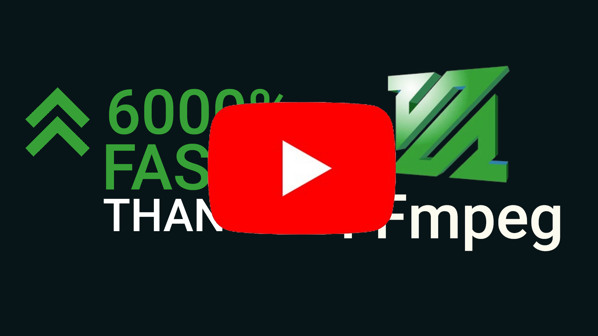

<p align="center">
  
</p>

<h1 align="center">Video Smartcut</h1>


This tool is an open-source CLI companion to [Smart Media Cutter](https://smartmediacutter.com).

`smartcut` can cut video files in many different formats and codecs with only minimal recoding around the cutpoints (a.k.a. "smart cut").

This means that you can cut even long video files in seconds!

In contrast, [Smart Media Cutter](https://smartmediacutter.com) is fully-featured linear video editor with a lot more features like: Easy to use GUI, Transcript based editing (edit videos like text documents), Automatic silence cutting, Export timeline to editors like Resolve & Premiere and a generous free tier.

## Demo
<p align="center">
  <a href=https://youtu.be/_OBDNVxydB4></a>
</p>

## Open Sourced Features

- **Efficient Cutting**: `smartcut` only recodes around the cutpoints, preserving the majority of the original video quality.
- **Flexible Input**: Supports a wide range of video/audio formats and codecs.
- **Flexible cutting**: Allows for both "keep" and "cut" operations based on specified input times.
- **Audio Export**: Includes all audio tracks by default with nearly lossless passthrough.

## Installation

Get built binaries for Windows and Linux from [releases](https://github.com/skeskinen/smartcut/releases).

To install from source:
```
# Clone this repository:
git clone https://github.com/skeskinen/smartcut.git
cd smartcut
# Create python virtual environment:
python -m venv .venv
source .venv/bin/activate
# Install the required dependencies:
pip install -r requirements.txt
# Run:
python ./smartcut input.mp4 output.mp4 --keep 10,20,40,50
```

## Usage

The CLI requires the input and output file paths as positional arguments. You can specify the segments to keep or cut using the `--keep` or `--cut` options.

### Basic Commands

- **Keep specific segments**:

  `smartcut.exe input.mp4 output.mp4 --keep 10,20,40,50`

  This keeps the segments from 10s to 20s and from 40s to 50s.

- **Cut specific segments**:

  `smartcut.exe input.mp4 output.mp4 --cut 30,40,01:00,01:10`

  This cuts out the segments from 30s to 40s and from 1m to 1m10s, keeping the rest.

- **Specify log level**:

  `smartcut.exe input.mp4 output.mp4 --keep 10,20 --log-level info`

### Audio Export

By default, all audio tracks are included with passthrough codec settings. This can be adjusted by modifying the `AudioExportInfo` in the script if needed.

## Contributing

Contributions are welcome! All the code will be licensed under MIT license.

Any changes have to work with the closed-source GUI app as well, so please coordinate with me if you want to make significant changes. You can find me on [discord](https://discord.gg/uYGkyfzU4c) most of the time.

## Testing

We have ok test coverage for various video and audio formats. Video tests check that pixel values are ~unchanged. In audio testing it's harder to check if the output is the same as input, but we try our best by checking the correlation of input&output as well as absolute diff.

Some of the tests depend on components in the GUI app that are not open-source. These tests are disabled.

Normal test run looks like this:
```
Skipping smc tests
test_h264_cut_on_keyframes: PASS
test_h264_smart_cut: PASS
test_h264_24_fps_long: PASS
test_h264_1080p: PASS
test_h264_multiple_cuts: PASS
test_h264_profile_baseline: PASS
test_h264_profile_main: PASS
test_h264_profile_high: PASS
test_h264_profile_high10: PASS
test_h264_profile_high422: PASS
test_h264_profile_high444: PASS
test_mp4_cut_on_keyframe: PASS
test_mp4_smart_cut: PASS
test_mp4_to_mkv_smart_cut: PASS
test_mkv_to_mp4_smart_cut: PASS
test_vp9_smart_cut: PASS
test_vp9_profile_1: PASS
test_av1_smart_cut: PASS
test_avi_smart_cut: PASS
test_flv_smart_cut: PASS
test_mov_smart_cut: PASS
test_wmv_smart_cut: PASS
test_mpg_cut_on_keyframes: PASS
test_mpg_smart_cut: PASS
test_m2ts_mpeg2_smart_cut: PASS
test_m2ts_h264_smart_cut: PASS
test_ts_smart_cut: PASS
test_night_sky: PASS
test_night_sky_to_mkv: PASS
test_sunset: PASS
test_h265_cut_on_keyframes: PASS
test_h265_smart_cut: PASS
test_h265_smart_cut_large: PASS
test_mp4_h265_smart_cut: PASS
test_vertical_transform: PASS
x265 [warning]: Source height < 720p; disabling lookahead-slices
x265 [warning]: Source height < 720p; disabling lookahead-slices
test_video_recode_codec_override: PASS
test_vorbis_passthru: PASS
test_mkv_with_video_and_audio_passthru: PASS
test_mp3_passthru: PASS
test_seeking: PASS
Tests ran in 153.6s
```

## Acknowledgements

* This project is part of [Smart Media Cutter](https://smartmediacutter.com)
* We use [PyAV](https://github.com/PyAV-Org/PyAV) to interface with [ffmpeg](https://www.ffmpeg.org/) internals in a pythonic way
* [avcut](https://github.com/anyc/avcut) is one of better smartcut implementations and their code was useful in understanding some of the nuances


## Other projects

* [lossless-cut](https://github.com/mifi/lossless-cut) has an experimental smartcut mode. Being an experimental feature, it's not really supported. [Link to discussion](https://github.com/mifi/lossless-cut/issues/126)
* [VidCutter](https://github.com/ozmartian/vidcutter) also has an experimental smartcut mode.
* [This shell script github gist](https://gist.github.com/fernandoherreradelasheras/5eca67f4200f1a7cc8281747da08496e) inspired the lossless-cut implementation of smartcutting.
* [VideoReDo](https://www.videohelp.com/software/VideoReDo) was a popular closed source frame accurate video trimming tool. It is no longer supported.
* [SolveigMM Video Splitter](https://www.solveigmm.com/en/products/video-splitter/) and [TMPGEnc MPEG Smart Renderer](https://tmpgenc.pegasys-inc.com/en/product/tmsr6.html) are 2 other commercial smartcutting tools. I have no experience with these. [Here's one review](https://github.com/mifi/lossless-cut/issues/126#issuecomment-2035823788)
* [mp3splt](https://mp3splt.sourceforge.net/mp3splt_page/home.php) does lossless cutting of mp3, vorbis and other audio formats
* [mp3DirectCut](https://mpesch3.de/) is a proprietary audio lossless cutting tool. This one supports mp3 and aac.
* [Avidemux](https://avidemux.sourceforge.net/) used to have a mode called [SmartCopy](https://www.avidemux.org/admWiki/doku.php?id=using:cutting#intra_frames_and_smartcopy) but according to [this forum post](https://avidemux.org/smif/index.php?topic=16372.0) it was removed in avidemux 2.6 and current version only supports cutting on keyframes (at least I think so).
* [Machete](https://www.machetesoft.com/) Quick and light lossless video cutting tool. Not free, but has a 14-day trial version.